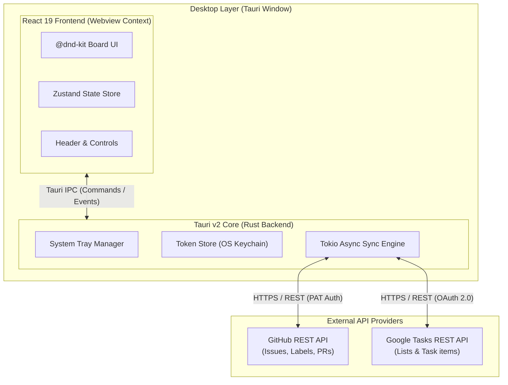

# WidKanban Architecture & System Design

This document details the architectural design, security model, data schemas, and Tauri IPC integration for **WidKanban**.

---

## 1. High-Level System Architecture



---

## 2. Data Normalization Schema

All tasks fetched from disparate external providers (GitHub Issues, Google Tasks) are normalized into a unified TypeScript interface:

```typescript
export type TaskSource = 'github' | 'google_tasks';
export type TaskStatus = 'todo' | 'in_progress' | 'done';

export interface UnifiedTask {
  id: string;             // Unique identifier, e.g., 'gh_102' or 'gt_abc123'
  title: string;          // Human-readable task title
  source: TaskSource;     // 'github' | 'google_tasks'
  status: TaskStatus;     // 'todo' | 'in_progress' | 'done'
  url: string;            // Direct web URL to the issue or task item
  updatedAt: string;      // ISO 8601 timestamp
  sourceMeta: {
    repo?: string;        // GitHub repository name
    issueNumber?: number; // GitHub issue/PR number
    labels?: string[];    // GitHub issue labels
    listId?: string;      // Google Task list identifier
    notes?: string;       // Google Task description/notes
    dueDate?: string;     // Google Task due date
  };
}
```

---

## 3. Security & Token Storage Model

> [!IMPORTANT]
> OAuth tokens and Personal Access Tokens (PATs) are **never** passed into or stored within the frontend JavaScript webview context to prevent XSS leak vectors.

1. **Rust Keychain Layer**: Auth tokens are encrypted and managed natively in Rust via OS Keychain services or `tauri-plugin-store`.
2. **IPC Scoping**: The frontend webview only sends IPC requests like `invoke('sync_tasks')` or `invoke('update_task_status', { taskId, status })`.
3. **No Direct Web Fetch for Auth**: All API network calls to GitHub and Google Tasks are executed inside Rust `reqwest` / async threads.

---

## 4. Sync Model & Write-Back Engine

- **Optimistic UI**: Moving a card in `@dnd-kit` immediately mutates local Zustand store state for instant visual feedback.
- **Async Write-back**: React invokes a Rust IPC command in the background:
  - **GitHub Write-back**: Moving to *Done* closes the issue (`PATCH /repos/{owner}/{repo}/issues/{number}`). Moving to *In Progress* applies an `in-progress` label.
  - **Google Tasks Write-back**: Moving to *Done* sets task status to `completed` (`PATCH /tasks/v1/lists/{listId}/tasks/{taskId}`).
- **Tokio Background Polling Loop**: A background thread polls APIs every ~3 minutes and emits a `tasks-updated` event to the webview.
